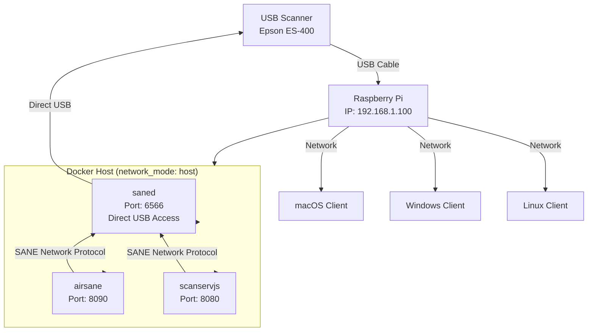
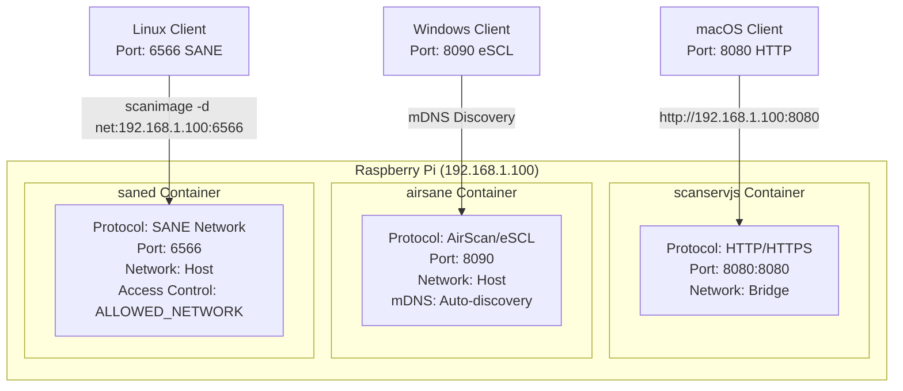
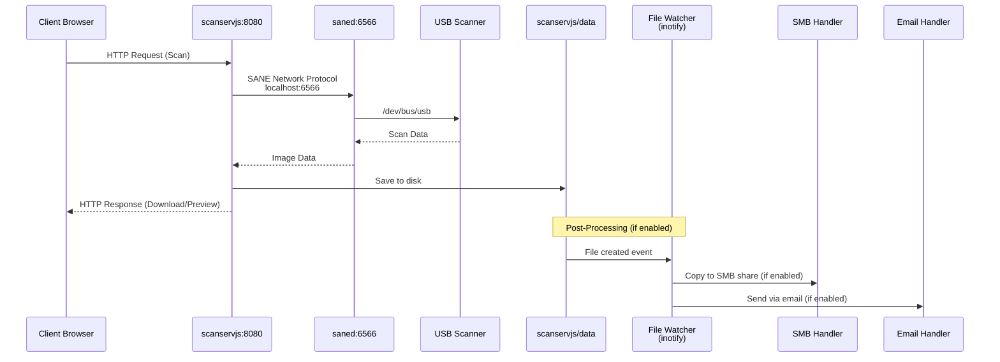
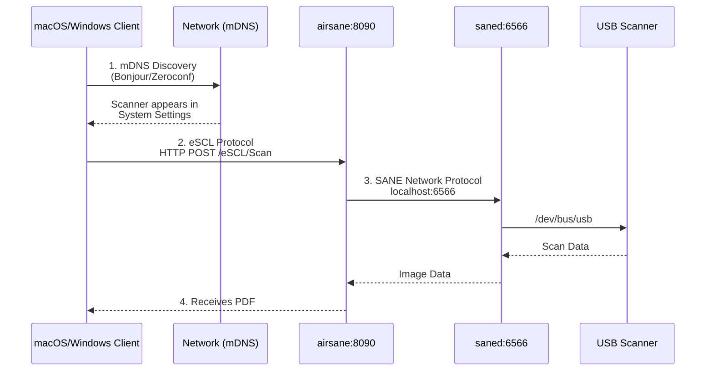
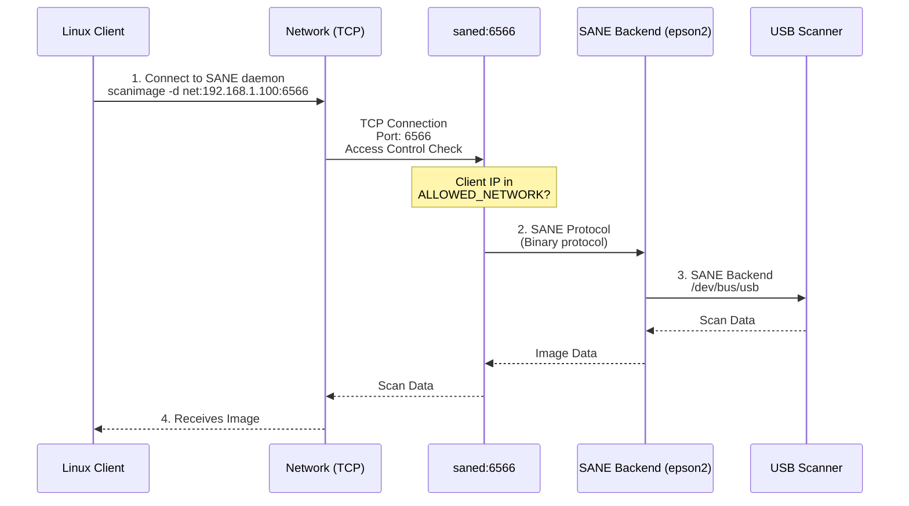
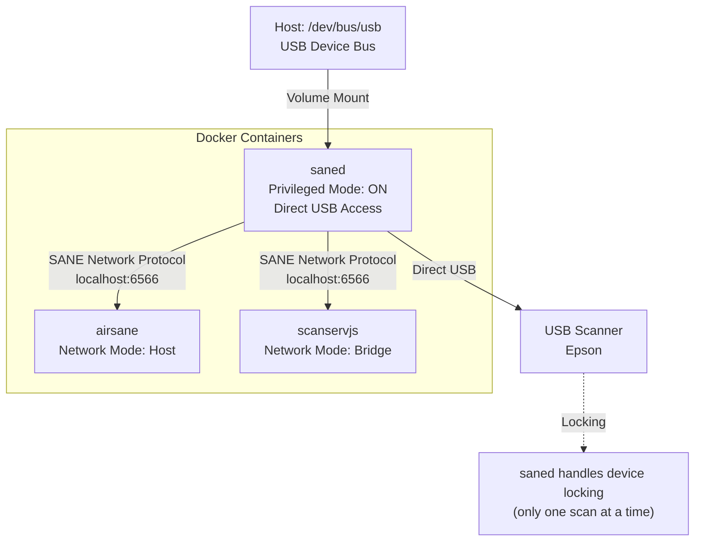
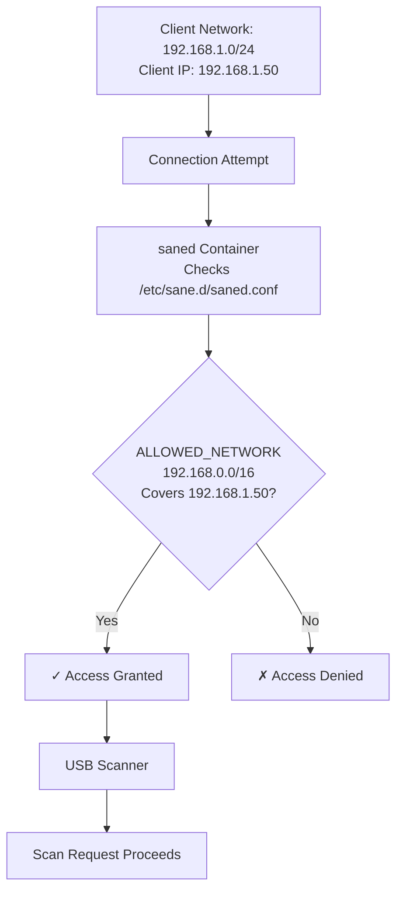

# SCAN Server - Multi-Protocol Scanner Sharing

This setup allows you to share an Epson ES-400 scanner (or other SANE-compatible scanner) across multiple computers using various protocols.

## Features

- **Web Interface** (ScanServJS) - Access from any browser
- **AirScan/eSCL** - Native support in macOS and Windows 10/11
- **SANE Network Protocol** - For Linux and SANE-compatible clients
- **SMB Network Share Output** - Automatically copy scans to network shares
- **Email Output** - Automatically email scans as attachments
- **Advanced Scanner Options** - Paper sizes, duplex, ADF/platen source selection

## System Architecture

### Physical Topology



### Network Topology & Port Mapping



### Port & Protocol Summary

| Service    | Protocol      | Port | Network Mode | Access Method                    |
|------------|---------------|------|--------------|----------------------------------|
| scanservjs  | HTTP/HTTPS    | 8080 | Bridge       | Browser: `http://PI_IP:8080`    |
| airsane    | AirScan/eSCL  | 8090 | Host         | Auto-discovery (mDNS/Bonjour)    |
| saned      | SANE Network  | 6566 | Host         | `scanimage -d net:PI_IP:6566`    |

### Data Flow: How Scanning Works

#### 1. Web Interface (ScanServJS)



#### 2. AirScan/eSCL (macOS/Windows)



#### 3. SANE Network Protocol (Linux)



### Container Communication

All three containers share the same USB device simultaneously:



**Key Points:**
- Only `saned` container has direct USB access (`privileged: true`, mounts `/dev/bus/usb`)
- `airsane` and `scanservjs` connect to `saned` via SANE Network Protocol (localhost:6566)
- `saned` acts as the central SANE daemon, managing all scanner access
- `saned` handles device locking (only one scan at a time)
- This architecture centralizes scanner control and simplifies access management

### Network Access Control



**Access Control Rules:**
- `ALLOWED_NETWORK`: Primary network range (required)
- `SECONDARY_NETWORK`: Additional networks (optional)
- Only applies to `saned` (SANE Network Protocol)
- `scanservjs` and `airsane` use their own access controls

## Quick Start

1. **Prerequisites**
   - Raspberry Pi with Docker and Docker Compose installed
   - Epson ES-400 connected via USB

2. **Configuration**
   - Edit `.env` file to match your network settings
   - See the `.env` file for detailed instructions on all configuration options

3. **Build and Start Services**

   **Option A: Use start.sh (Recommended)**
   ```bash
   ./start.sh
   ```
   The start script automatically builds the custom saned image if needed, validates configuration, and starts all services.

   **Option B: Manual Docker Compose**
   ```bash
   docker-compose build  # First time only - builds saned image
   docker-compose up -d   # Start all services in background
   ```

4. **Access Scanner**
   - Web Interface: `http://[PI_IP]:8080`
   - macOS Image Capture: Scanner appears automatically
   - Windows Scan: Scanner appears automatically

## How to Scan

### Method 1: Web Interface (Any Device)

**Steps:**
1. Open browser on any device (computer, tablet, phone)
2. Navigate to: `http://[PI_IP]:8080`
   - Replace `[PI_IP]` with your Raspberry Pi's IP address
   - Example: `http://192.168.1.100:8080`
3. Select your scanner from the device list
4. Configure scan settings:
   - **Paper Size**: Letter (default), Legal, A4, A5, or custom dimensions
   - **Source**: ADF Simplex (default), ADF Duplex, or Platen (Flatbed)
   - **Color Mode**: Color, Grayscale, or Black & White
   - **Resolution**: Adjustable DPI setting
5. Click "Scan" button
6. Download or preview the scanned document
7. File is automatically processed:
   - Saved to `scanservjs/data/` directory
   - Copied to SMB share (if enabled)
   - Sent via email (if enabled)

**Data Flow:**
```
Browser → HTTP → scanservjs:8080 → SANE → USB Scanner → scanservjs/data → Browser
```

**Output:** 
- Files saved in `scanservjs/data/` directory on Pi, downloadable via browser
- Optionally copied to SMB network share (if configured)
- Optionally sent via email (if configured)

### Method 2: macOS Image Capture / Preview

**Steps:**
1. Open **Image Capture** (Applications > Image Capture) or **Preview**
2. Scanner should appear automatically in device list
   - If not visible, wait 30-60 seconds for mDNS discovery
   - Check network connection to Pi
3. Select scanner from sidebar
4. Configure scan settings in Image Capture
5. Click "Scan" button
6. Image appears in Preview or chosen destination

**Data Flow:**
```
macOS → mDNS Discovery → airsane:8090 → eSCL Protocol → SANE → USB Scanner → macOS
```

**Output:** Directly to macOS (Preview, folder, or app of choice)

### Method 3: Windows Scan App

**Steps:**
1. Open **Windows Scan** app (built into Windows 10/11)
   - Or: Settings > Devices > Printers & scanners > Add device
2. Scanner should appear automatically
   - If not, click "Add device" and wait for discovery
3. Select scanner from list
4. Configure scan settings (color, resolution, file type)
5. Click "Scan" button
6. Choose save location

**Data Flow:**
```
Windows → mDNS Discovery → airsane:8090 → eSCL Protocol → SANE → USB Scanner → Windows
```

**Output:** Directly to Windows (chosen folder or app)

### Method 4: Linux SANE Network Protocol

**Prerequisites:**
- Install SANE on client: `sudo apt-get install sane sane-utils` (Debian/Ubuntu)
- Or: `sudo yum install sane-backends sane-backends-drivers-scanners` (RHEL/CentOS)

**Steps:**
1. Configure SANE to use network scanner:
   ```bash
   # Add to /etc/sane.d/net.conf on client
   echo "192.168.1.100" | sudo tee -a /etc/sane.d/net.conf
   ```
   Replace `192.168.1.100` with your Pi's IP address

2. Test scanner detection:
   ```bash
   scanimage -L
   # Should show: device `net:192.168.1.100:6566:epson2:libusb:001:003' is a ...
   ```

3. Scan to file:
   ```bash
   # Scan to PPM file
   scanimage -d net:192.168.1.100:6566 --format=ppm > scan.ppm
   
   # Scan with options
   scanimage -d net:192.168.1.100:6566 \
     --mode Color \
     --resolution 300 \
     --format=png > scan.png
   ```

4. Use with scanning applications:
   - **XSane**: `xsane net:192.168.1.100:6566`
   - **Simple Scan**: Should auto-detect network scanner
   - **gscan2pdf**: Select network scanner from device list

**Data Flow:**
```
Linux Client → TCP:6566 → saned → SANE Protocol → USB Scanner → TCP:6566 → Linux Client
```

**Output:** Directly to client (file or application)

**Troubleshooting Linux SANE:**
- Verify network access: `telnet 192.168.1.100 6566` (should connect)
- Check firewall: Ensure port 6566 is open
- Verify ALLOWED_NETWORK in `.env` includes client's network
- Test with verbose mode: `scanimage -d net:192.168.1.100:6566 -v`

## Commands

- `./start.sh` - Start all services
  - `./start.sh --skip-check` or `./start.sh --force` - Skip USB scanner detection check (useful for automation)
  - `./start.sh --help` - Show usage information
- `./stop.sh` - Stop all services gracefully
- `./status.sh` - Check service status and scanner detection
- `docker-compose logs -f` - View logs from all services
- `docker-compose logs -f [service]` - View logs from a specific service (saned, airsane, or scanservjs)

## Directory Structure

```
SCAN/
├── .env                    # Environment variables (edit to configure)
├── .gitignore              # Git ignore rules
├── docker-compose.yml      # Service definitions with health checks
├── start.sh                # Start script (with --skip-check option)
├── stop.sh                 # Stop script (graceful shutdown)
├── status.sh               # Status check script
├── saned/                  # SANE daemon configs
│   ├── Dockerfile          # Custom saned image
│   ├── .dockerignore       # Docker build context exclusions
│   ├── saned.conf          # Network access control (template)
│   └── dll.conf            # SANE backend selection
├── scanservjs/             # Web interface configs
│   ├── Dockerfile          # Custom scanservjs image (SMB/email support)
│   ├── config.json         # ScanServJS configuration
│   ├── config.local.js     # Local config (defaults: Letter, ADF Simplex)
│   ├── post-scan.sh        # Post-scan orchestrator script
│   ├── smb-handler.sh      # SMB network share handler
│   ├── email-handler.sh    # Email sending handler
│   ├── file-watcher.sh     # File system event watcher (inotify)
│   ├── entrypoint.sh       # Custom entrypoint
│   └── data/               # Scanned files (gitignored)
└── airsane/                # AirScan configs
    └── airsane.conf        # AirSane configuration
```

## Features & Improvements

- **Health Checks**: All services include Docker health checks for automatic monitoring
- **Error Handling**: Scripts include robust error handling and validation
- **Non-Interactive Mode**: Supports automated deployments with `--skip-check` flag
- **Configurable Scanner Brand**: Support for different scanner brands via `SCANNER_BRAND` variable
- **Pinned Versions**: Docker images use specific versions for stability
- **Graceful Shutdown**: Services stop gracefully, allowing active scans to complete
- **SMB Network Share**: Automatic copying of scans to SMB/CIFS network shares
- **Email Output**: Automatic email delivery of scanned documents
- **File System Monitoring**: Uses inotify for real-time file event detection (no polling)
- **Modular Post-Processing**: Separate handlers for SMB and email (easy to extend)
- **Scanner Options**: Configurable paper sizes, color modes, duplex, and source (ADF/platen)

## Customization

All settings can be configured in the `.env` file. The file contains inline instructions for each option.

### Critical Configuration

**`ALLOWED_NETWORK`** (Required) - Set this to your local network range in CIDR notation (e.g., `192.168.0.0/16`, `192.168.1.0/24`). This controls which networks can access the scanner via SANE network protocol.

For all other settings, including ports, scanner brand, debug levels, timezone, SMB share, and email configuration, see the `.env` file for detailed instructions and default values.

### ScanServJS Output Destinations

ScanServJS supports multiple output destinations for scanned files:

#### SMB Network Share
Configure in `.env`:
- `SMB_ENABLED=true` - Enable SMB copying
- `SMB_SERVER` - SMB server address (e.g., `192.168.1.10` or `fileserver.example.com`)
- `SMB_SHARE` - Share name (e.g., `scans` or `shared/scans`)
- `SMB_USER` - Username for authentication
- `SMB_PASS` - Password for authentication
- `SMB_DOMAIN` - Domain (optional, for Windows domain authentication)

**How it works:**
- SMB share is mounted once and reused across scans
- Automatically detects and recovers from stale mounts
- Files are copied immediately after scanning completes

#### Email Output
Configure in `.env`:
- `EMAIL_ENABLED=true` - Enable email sending
- `SMTP_SERVER` - SMTP server address (e.g., `smtp.gmail.com`)
- `SMTP_PORT` - SMTP port (default: `587` for TLS)
- `SMTP_USER` - SMTP username
- `SMTP_PASS` - SMTP password
- `EMAIL_FROM` - Sender email address
- `EMAIL_TO` - Recipient email address
- `EMAIL_SUBJECT` - Email subject prefix

**How it works:**
- Scanned files are sent as email attachments
- Supports both sendmail and Python SMTP methods
- Automatic fallback if one method is unavailable

### ScanServJS Scanner Options

The web interface supports configurable scanner options:

- **Paper Sizes**: Letter, Legal, A4, A5, A3, B4, B5, Executive, Folio, Quarto, Tabloid
- **Color Modes**: Color, Grayscale, Black & White (Lineart)
- **Duplex**: Simplex (single-sided) or Duplex (double-sided)
- **Source**: Platen (Flatbed) or ADF (Automatic Document Feeder)

**Default Settings:**
- Paper Size: **Letter** (configured in `scanservjs/config.local.js`)
- Source: **ADF Simplex** (configured in `scanservjs/config.local.js`)

To change defaults, edit `scanservjs/config.local.js` and rebuild the container.

## Troubleshooting

### Scanner Detection Issues

1. **Scanner not detected on USB**:
   ```bash
   lsusb | grep -i epson  # Check if scanner is connected
   ```
   - Verify USB connection
   - Try a different USB port
   - Check if scanner is powered on
   - Use `./start.sh --skip-check` to bypass USB check if scanner is detected in containers

2. **Scanner not detected in containers**:
   ```bash
   ./status.sh  # Check detection status in all containers
   docker exec saned scanimage -L  # Test SANE daemon
   docker exec airsane scanimage -L  # Test AirSane
   docker exec scanservjs scanimage -L  # Test ScanServJS
   ```

### Service Issues

3. **Services not starting**:
   ```bash
   docker-compose logs -f  # View all logs
   docker-compose logs -f saned  # View specific service logs
   ```
   - Check if required environment variables are set (see error message)
   - Verify `.env` file exists and is properly formatted
   - Check Docker daemon is running: `docker ps`

4. **Container health checks failing**:
   ```bash
   docker-compose ps  # Check health status
   ```
   - Containers may need more time to initialize (40s start period)
   - Check if scanner is properly connected
   - Review logs for specific errors

### Network Access Issues

5. **Cannot access from network**:
   - Verify firewall settings allow the configured ports
   - Check network ranges in `.env` match your network
   - Ensure services are using `network_mode: host` (saned, airsane) or port mapping (scanservjs)
   - Test locally first: `curl http://localhost:8080` (for scanservjs)

6. **Environment variable errors**:
   - Ensure `.env` file exists (it should be created automatically)
   - Verify all required variables are set: `ALLOWED_NETWORK`, `SCANSERVJS_PORT`, `AIRSANE_PORT`, `SANED_PORT`
   - Check for syntax errors (no spaces around `=` in `.env`)

### Debug Mode

Enable verbose debugging by setting in `.env`:
```bash
SANE_DEBUG_LEVEL=128
```
Then restart services: `./stop.sh && ./start.sh`

## Auto-start on Boot

To start services automatically on boot:

### Option 1: Using systemd (Recommended)

Create a systemd service file `/etc/systemd/system/scan-server.service`:

```ini
[Unit]
Description=SCAN Server Scanner Services
Requires=docker.service
After=docker.service

[Service]
Type=oneshot
RemainAfterExit=yes
WorkingDirectory=/path/to/SCAN
ExecStart=/path/to/SCAN/start.sh --skip-check
ExecStop=/path/to/SCAN/stop.sh
User=your-username

[Install]
WantedBy=multi-user.target
```

Then enable and start:
```bash
sudo systemctl daemon-reload
sudo systemctl enable scan-server.service
sudo systemctl start scan-server.service
```

### Option 2: Using cron

```bash
sudo systemctl enable docker
crontab -e
# Add: @reboot cd /path/to/SCAN && ./start.sh --skip-check
```

**Note:** Use `--skip-check` flag for non-interactive startup (required for automation).
